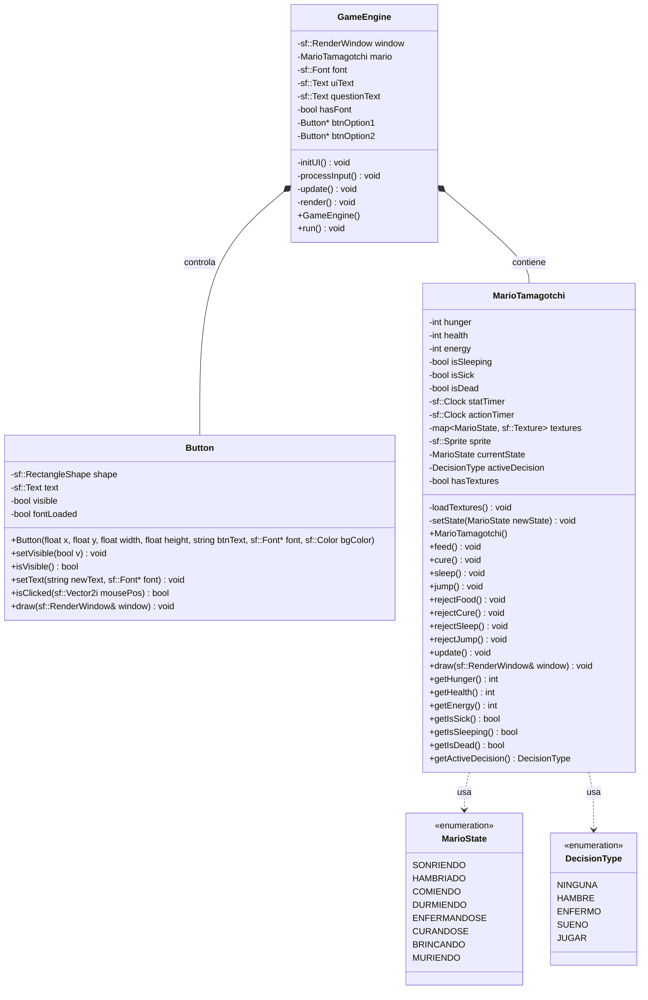

```mermaid
classDiagram
    class MarioState {
        <<enumeration>>
        SONRIENDO
        HAMBRIADO
        COMIENDO
        DURMIENDO
        ENFERMANDOSE
        CURANDOSE
        BRINCANDO
        MURIENDO
    }

    class DecisionType {
        <<enumeration>>
        NINGUNA
        HAMBRE
        ENFERMO
        SUENO
        JUGAR
    }

    class Button {
        -sf::RectangleShape shape
        -sf::Text text
        -bool visible
        -bool fontLoaded
        +Button(float x, float y, float width, float height, string btnText, sf::Font* font, sf::Color bgColor)
        +setVisible(bool v) void
        +isVisible() bool
        +setText(string newText, sf::Font* font) void
        +isClicked(sf::Vector2i mousePos) bool
        +draw(sf::RenderWindow& window) void
    }

    class MarioTamagotchi {
        -int hunger
        -int health
        -int energy
        -bool isSleeping
        -bool isSick
        -bool isDead
        -sf::Clock statTimer
        -sf::Clock actionTimer
        -map~MarioState, sf::Texture~ textures
        -sf::Sprite sprite
        -MarioState currentState
        -DecisionType activeDecision
        -bool hasTextures
        -loadTextures() void
        -setState(MarioState newState) void
        +MarioTamagotchi()
        +feed() void
        +cure() void
        +sleep() void
        +jump() void
        +rejectFood() void
        +rejectCure() void
        +rejectSleep() void
        +rejectJump() void
        +update() void
        +draw(sf::RenderWindow& window) void
        +getHunger() int
        +getHealth() int
        +getEnergy() int
        +getIsSick() bool
        +getIsSleeping() bool
        +getIsDead() bool
        +getActiveDecision() DecisionType
    }

    class GameEngine {
        -sf::RenderWindow window
        -MarioTamagotchi mario
        -sf::Font font
        -sf::Text uiText
        -sf::Text questionText
        -bool hasFont
        -Button* btnOption1
        -Button* btnOption2
        -initUI() void
        -processInput() void
        -update() void
        -render() void
        +GameEngine()
        +run() void
    }

    GameEngine *-- MarioTamagotchi : contiene
    GameEngine *-- Button : controla
    MarioTamagotchi ..> MarioState : usa
    MarioTamagotchi ..> DecisionType : usa
```